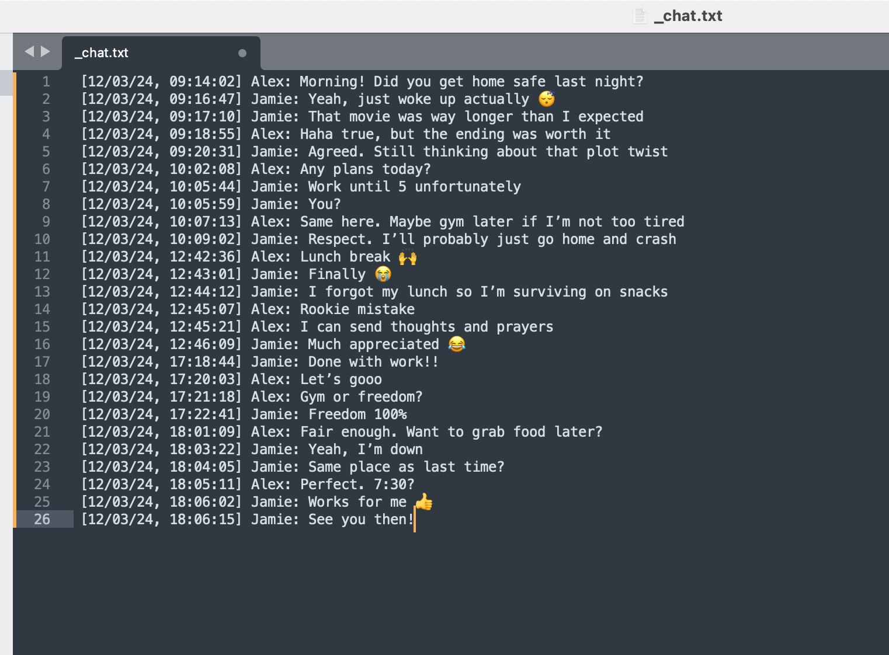
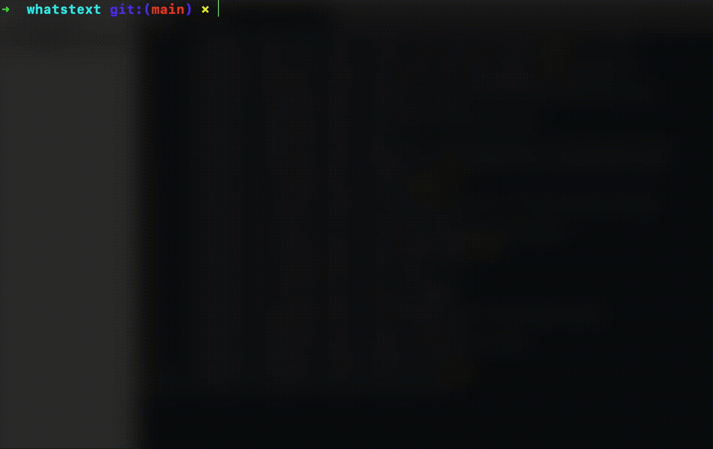
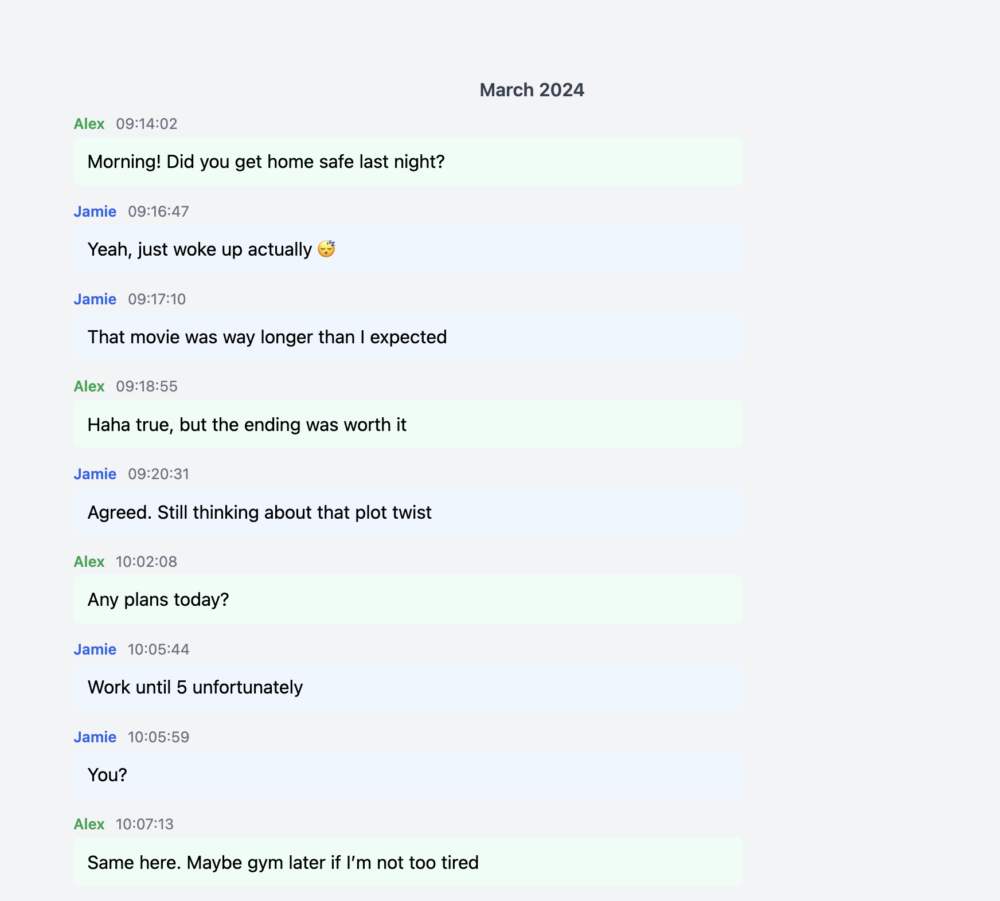

# WhatsText
WhatsText makes WhatsApp chat exports more readable and interesting.

- [Why?](#Why?)
    - [Demo](#demo)
- [Installation](#Installation)
    - Method 1: pypi
    - Method 2: Install From Source
- [Dependencies](#Dependencies)
- [Usage](#Usage)
- [Configuration](#Configuration)
- [Output Structure](#Output)
- [Change Log](/Changelog.md)
- [Want to Contribute?](#Contribute)
- [References](#FOSS)

## Why ?

When you export a whatsapp chat through the WhatsApp UI pon Android/iOS, the Whatsapp export button exports it to a text file with or without media attachments as a zip file.

WhatsText now works directly with that exported `.zip` — media and all. Just drag it onto WhatsText and it takes care of the rest, no manual unzipping required.

**WhatsText makes it interesting to read and view like regular chat**

### Demo 

All you need to do is to install the python package and run it against your chat export. (Now as simple as dragging your export `.zip` onto WhatsText — see [Usage](#Usage) below.)

1. A boring export :



2. After using WhatsText :



3. Becomes interesting :



### Features 

**0.1.0**

- [x] Parsing Chat Log for regular chats 
- [ ] Speedy processing
- [x] Parsing Attachments

0.1.2

- [x] Parsing for Group Chats

1.0

- [ ] 3 Themes to choose from 
- [x] Light/Dark Mode

Also added along the way:

- [x] Drag-and-drop local app — no command-line arguments needed
- [x] WhatsApp-style chat bubbles, sent/received alignment
- [x] Attachments rendered inline (photos, videos, audio, stickers, files)
- [x] Single-click launcher (`WhatsText.command` / `WhatsText.bat`) — no terminal, no install

Planned next:

- [ ] Profanity filter
- [ ] Clickable links (URLs in messages become clickable)

**WhatsText makes that interesting.**

## Installation

1. Use Pip to install WhatsText and dependencies on your machine 
```pip install better_profanity```
```pip install WhatsText```

Then run it with:
```whatstext```

2. Download the project onto your local machine and run 
```
pip install -e .
whatstext
```

3. No pip, no terminal: download the project and double-click `WhatsText.command` (macOS) or `WhatsText.bat` (Windows) — it finds your Python install and launches WhatsText for you.

## Dependencies

- Standard python libraries 

## Usage

```whatstext```

1. This opens a page in your browser with a drop zone.
2. Drag your WhatsApp export `.zip` onto it (the same one WhatsApp gives you from Export Chat — media included).
3. Pick which participant is you — your messages align to the right, like in WhatsApp.
4. Browse the chat, month by month, with a dark mode toggle in the header.

Everything runs locally — nothing leaves your machine.

## Configuration

- Yet to add customizability
- What's configurable today: light/dark mode (toggle in the header) and which chat participant is "you" (asked once per chat, right after you drop the export)

## Output 

- Output generated as a zip in  ```path/to/file```
- This now opens live in your browser instead — no zip to extract. Extracted media is kept in a temporary folder that's automatically deleted when you close WhatsText.

## Contribute
This project is open for contribution, as long as it remains useful.

### Raise an Issue
- If you find and issue please report it by creating a new issue at 
https://github.com/sdemanas/WhatsText/issues

- If a similar issue already exists please add to the same.

### Create a PR

To submit a new feature request raise an issue, describe your requirements and create a PR.


### Active Maintainers

[sdemanas](https://github.com/sdemanas)

## FOSS

List of open source projects and references used for building WhatsText 
